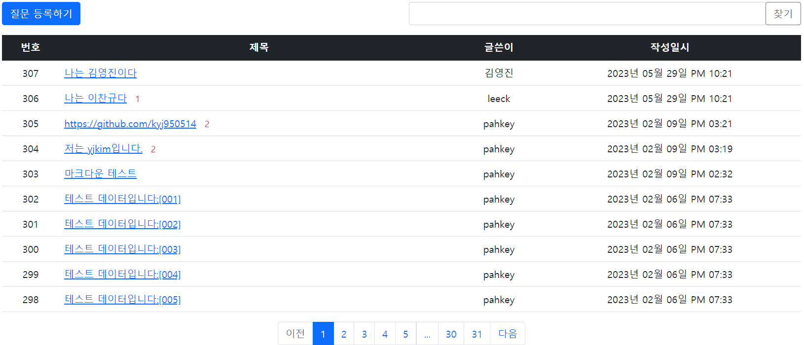

# Python-Flask
Flask Framework를 이용하여 웹사이트를 구축하는 프로젝트입니다.
   

* 웹사이트 기능
  * 회원가입, 글쓰기, 답변, 수정, 삭제, 추천, 검색 등 실제 웹사이트에서 동작하는 기능 대부분 탑재 및 정상 실행
  * DB 연동 저장 및 조회 기능
    
 
 
* Language / IDE
  * HTML, CSS, JS
  * Python, Flask
  * PyCharm
  * SQLite
  * AWS
    

* 실제 웹사이트 예시

